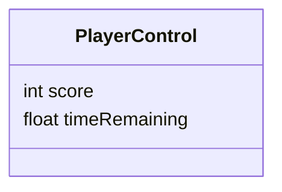

# Welcome to SaladChef2D!

Salad2D is a prototype of a (upcoming) salad chef simulation made in  **Unity** [ A cross-platform game engine ]. 
>Below are the feature sets for this 1st Phase:

## Features
### Static top-down view:
- The level or the camera is static top down which pans in/out depending on the distance between players in the level.

### Couch Co-op
- Two players can play on one machine using different keys to control two characters
- In this first version, the players will be using keyboard, no game-pad.

### Vegetables
- [*ref. img*] The Grey boxes with letters on them are the different vegetables will be collected by the chef for salad making.

### Item Placing & Gameplay
- The players in Blue & Red [*ref. img*]can pick up vegetables from both sides of the room
- A vegetable picked up by the player can then be placed on the Chopping Board[*ref. img*].It takes some time to chop the vegetables meanwhile the player cannot move.
- [*ref. img 'Player carrying 2 veggies'*] A Player can carry maximum two vegetables and the names can be seen on them.The vegetable that was picked up first will be chopped first.
- Once the vegetable is chopped, the other vegetable can be placed on the chopping board to create different combinations.
- The combination can then be picked by the player from chopping board and served to the customer by putting it on the customer plate. The player can also throw the salad into the trashcan which will result in some minus points.

### Customer Interaction
- All customers have salads in need, which the players have to serve. The score count increases when the player gives the right combinations to the customer.
- A customer waits for a defined period of time indicated by the bar above the customer and timer[*ref. img*] leaving dissatisfied if not served.
- If the player delivers salads in time , the player score increases, if the time runs out, the customer will leave which will result in minus points for both players.
- <u>[*INPROGRESS*]</u> Angry Customer: The waiting time of the customer will decrease faster.If he does not get fed correctly within that time, the minus points are doubled and given solely to the player that delivered wrong salad. If both players delivered incorrectly then both players will be penalized.
- <u>[*TWEAK*]</u>If a salad is served to a customer before 70% of the waiting time, the customer will award the players with a pickup. The Power/Pickup will be spawned at a random free spot in the level. 

### Implementation of Differen Power/PickUps 
-- *Speed* - Increases the movement of player.
-- *Time* - Increases the overall time that the player has left.
-- *Score* - Adds some points to the player score count.
- Game will end if the timer of both the players runs out.
- Winning message will get displayed (Player with the highest count wins)
- <u>[*INPROGRESS*]</u> A high sccore list will be displayed with the top 10 scores.
- Reset option on end screen.[*ref. img ]

## ScreenShots
> Initial Screen

> Player Carrying Vegetables

> PowerUps


# <u>[*Documentation INPROGRESS*]</u>
## UML diagrams
### Class Diagram 
Below are the class diagrams of the implemented prototype of the game



Flow chart:

```mermaid
graph LR

```
